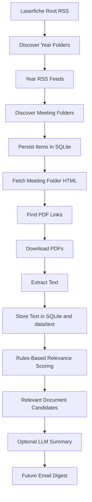

# Data Center Ceramics

Initial scope: monitor one official Loudoun County government source, detect newly posted Board of Supervisors meeting entries, and persist them locally.

## Current milestone

Track the Loudoun County Board of Supervisors business-meeting packet repository:

- source feed snapshots saved on each run
- extracted meeting folders stored in SQLite
- PDFs from newly discovered meeting folders downloaded locally
- extracted PDF text stored locally and in SQLite
- rules-based relevance scoring stored in SQLite
- optional LLM summaries persisted for relevant documents
- new meeting entries reported on stdout

This is intentionally smaller than full digest assembly or email delivery. The immediate goal is proving that one source is stable and can be monitored idempotently.

## Rough flow



In the current code, everything through `Rules-Based Relevance Scoring` is always wired into the ingestion pipeline. `Optional LLM Summary` is available both as an opt-in pipeline step and as a backfill CLI for already-extracted relevant documents.

## Chosen source

- Loudoun County Laserfiche repository for Board of Supervisors business meetings, public hearings, and special meetings
- Root folder: <https://lfportal.loudoun.gov/LFPortalinternet/0/fol/98907/Row1.aspx>

The public Loudoun page embeds this Laserfiche folder. The scraper now uses the Laserfiche root RSS feed to discover recent year folders, the year-level RSS feeds to discover actual meeting folders such as `03-17-26 Business Meeting`, and falls back to the HTML portal if the RSS path fails.

## Project layout

- `config/sources.json`: source registry
- `docs/source_inventory.md`: active and candidate source record
- `data/`: local runtime artifacts
- `scripts/run_once.py`: one-source ingest entrypoint
- `scripts/summarize_document.py`: ad hoc document summary CLI
- `scripts/summarize_relevant_documents.py`: backfill summaries from stored relevant documents
- `scripts/validate_gemini_live.py`: live Gemini validation on the sample corpus
- `src/data_center_digest/`: application code

## Local run

```bash
uv run python scripts/run_once.py
```

Optional arguments:

```bash
uv run python scripts/run_once.py --source-id loudoun_bos_meeting_documents
uv run python scripts/run_once.py --db-path data/app.db --data-dir data
uv run python scripts/run_once.py --source-id loudoun_bos_meeting_documents --summarize-relevant --summarize-limit 3
```

Useful one-off checks:

```bash
uv run python -m py_compile src/data_center_digest/*.py scripts/*.py
uv run python scripts/run_once.py --source-id loudoun_bos_meeting_documents --document-download-limit 1
```

## Pipeline stages

1. `laserfiche.py` discovers meeting folders from RSS feeds.
2. `run_once.py` stores unseen items and expands new meeting folders.
3. Meeting-folder HTML is parsed to collect PDF links.
4. PDFs are downloaded into `data/items/...`.
5. `pdf_text.py` extracts embedded text first, then OCRs thin/scanned pages if needed.
6. `relevance.py` scores extracted text for data-center-adjacent signals.
7. `summarizer.py` can summarize relevant text with Gemini or Ollama.
8. Summary JSON is stored in SQLite and written under `data/summaries/...`.

## Summarization Backends

Use the same prompt and JSON schema with either Gemini or Ollama.

Gemini:

```bash
export SUMMARY_BACKEND=gemini
export GEMINI_API_KEY=...
export GEMINI_MODEL=gemini-2.5-flash-lite
uv run python scripts/summarize_document.py "data/text/.../Item 11 LEGI-2024-0002_ Concorde Industrial Park.txt"
```

Ollama:

```bash
export SUMMARY_BACKEND=ollama
export OLLAMA_MODEL=gemma3:4b-it-qat
export OLLAMA_API_BASE=http://localhost:11434
uv run python scripts/summarize_document.py "data/text/.../Item 11 LEGI-2024-0002_ Concorde Industrial Park.txt"
```

Current local default: `gemma3:4b-it-qat`. It performed better than `gemma3n:e2b` in the repo bakeoff on `Concorde Industrial Park` and `Franklin Park West`.

The switching logic lives in `src/data_center_digest/summarizer.py`, so the pipeline can change providers without changing the prompt format or output schema.

Backfill existing relevant documents from SQLite:

```bash
export SUMMARY_BACKEND=gemini
export GEMINI_API_KEY=...
uv run python scripts/summarize_relevant_documents.py --source-id loudoun_bos_meeting_documents --limit 5
```

Run a focused live Gemini validation pass on the three sample land-use documents:

```bash
export SUMMARY_BACKEND=gemini
export GEMINI_API_KEY=...
export GEMINI_MODEL=gemini-2.5-flash-lite
uv run python scripts/validate_gemini_live.py
```

This writes a JSON report under `data/evals/gemini_live_validation.json` with per-document latency, success/failure, and the normalized summary payload.

## What comes next

After this baseline works:

1. tune keyword relevance filtering with real false positives/negatives
2. add digest assembly and email notifications
3. validate Gemini live on the sample corpus and compare it against the local Ollama baseline
